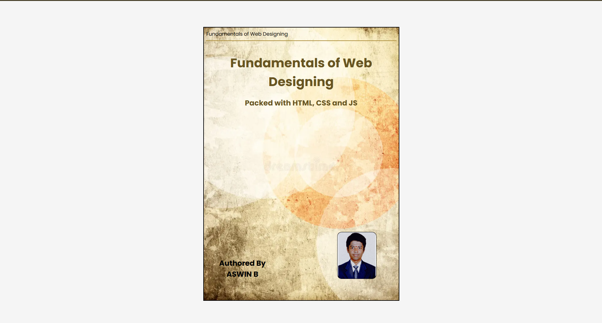

# Ex.05 Book Front Cover Page Design
## Date: 14-02-2026

## AIM:
To design a book front cover page using HTML and CSS.

## DESIGN STEPS:

### Step 1:
Create a Django Admin project.

### Step 2:
Create an app in the Django interface.

### Step 3:
Create a folder named 'static' in the app folder.

### Step 4:
Create a new HTML file in the static folder.

### Step 5:
Write the HTML code with relevant CSS properties.

### Step 6:
Choose the appropriate style and color scheme.

### Step 7:
Insert the images in their appropriate places.

### Step 8:
Publish the website in the LocalHost.

## PROGRAM:
### index.html:
```html
<!doctype html>
<html lang="en">
  <head>
    <meta charset="UTF-8" />
    <meta name="viewport" content="width=device-width, initial-scale=1.0" />
    <title>Document</title>
    <link rel="stylesheet" href="style.css" />
  </head>
  <body>
    <section class="book">
      <div class="cover">
        
        <p>Fundamentals of Web Designing</p>
        <hr />
        <h1>Fundamentals of Web Designing</h1>
        <h3>Packed with HTML, CSS and JS</h3>

        <div class="image">
          
        </div>

        <h3 class="author">
          Authored By <br />
          ASWIN B
        </h3>
      </div>
    </section>
  </body>
</html>

```

### style.css:
```css
@import url("https://fonts.googleapis.com/css2?family=Poppins:ital,wght@0,100;0,200;0,300;0,400;0,500;0,600;0,700;0,800;0,900;1,100;1,200;1,300;1,400;1,500;1,600;1,700;1,800;1,900&display=swap");

* {
  margin: 0;
  padding: 0;
  box-sizing: border-box;
}

body {
  font-family: "Poppins", sans-serif;
  background: #f5f5f5;
}

.cover {
  border: 2px solid black;
  width: 500px;
  height: 700px;
  position: absolute;
  top: 8%;
  justify-self: center;
  overflow: hidden;
}

.cover p {
  font-size: 0.8rem;
  color: black;
  padding: 0.4rem;
}

hr {
  width: 98%;
  border: rgb(173, 141, 58) 0.01rem solid;
  justify-self: center;
}

h1 {
  text-align: center;
  padding-top: 2rem;
  font-size: 2rem;
  color: rgb(105, 85, 33);
}

h3 {
  text-align: center;
  padding: 1rem;
  color: rgb(105, 85, 33);
}

.bg-image {
  position: absolute;
  top: 0;
  left: 0;
  width: 100%;
  height: 100%;
  object-fit: cover;
  z-index: -1;
}

.image {
  border: 1px solid black;
  position: relative;
  width: 100px;
  height: 120px;
  top: 300px;
  left: 340px;
  border-radius: 0.7rem;
}

.aut-img {
  position: relative;
  top: 0;
  left: 0;
  width: 100%;
  height: 100%;
  object-fit: cover;
  z-index: -1;
  border-radius: 0.6rem;
}

.author {
  position: relative;
  top: 230px;
  right: 150px;
  color: black;
  text-align: center;
}

```

## OUTPUT:


## RESULT:
The program for designing book front cover page using HTML and CSS is completed successfully.


Name : ASWIN B \
Register Number : 212224110007